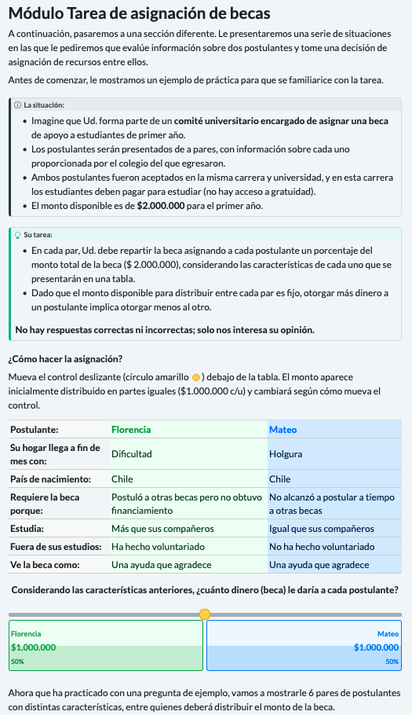

---
format:
  html:
    toc: true
    toc-expand: true
    css: justify.css
---

```{r setup, include=FALSE, message=FALSE}
knitr::opts_chunk$set(echo=FALSE, 
                      warning = FALSE,
                      message = FALSE, 
                      cache = TRUE,
                      out.width = '85%',
                      fig.pos= "H")
options(scipen=999)
options(kableExtra.auto_format = FALSE)
options(knitr.kable.NA = '')
options(knitr.graphics.error = FALSE)
Sys.setlocale("LC_ALL", "ES_ES.UTF-8")
table_format = if (knitr::is_html_output()) {
   #conditional instructions for kable
   "html" #if html set "html" in format
 } else if (knitr::is_latex_output()) {
   "latex"#if latex set "latex" in format
 }

```

```{r}
#| echo: false
#| cache.extra: tools::md5sum("../processing/cjpow.R")

library(here)
here::i_am("documentation/03-conjoint-desing.qmd")

source(file = here("processing/cjpow.R"))

```

# Questionnaire design A: Distributive Conjoint Survey Experiment {#dis-conjoint}

## Overview

This document specifies the design and implementation of the distributive conjoint module included in the survey. In this module, respondents act as members of a university committee and divide a fixed scholarship fund between two applicants whose attributes are experimentally randomized, so that allocating more to one applicant necessarily means allocating less to the other. The design adapts the Distributional Survey Experiment of @gilgen_disentangling_2022 to a conjoint format [@hainmueller_causal_2014], combining the tabular presentation and complete, independent randomization of a conjoint experiment with the fixed-sum allocation task characteristic of distributive designs. The applicant attributes operationalize deservingness criteria drawn from the welfare deservingness literature, specifically the CARIN and recast NICER frameworks [@oorschot_who_2000; @meuleman_welfare_2020; @knotz_recast_2022]; the theoretical rationale for each attribute, the derivation of the hypotheses, and the analysis plan are documented separately in the [Pre Analysis Plan](https://jus-mer.github.io/survey-jusmer/surveys/conjoint-test/design/conjoint-preplan.html). The remainder of this document describes the survey structure, the attributes and their levels, the randomization procedure, and the technical implementation of the module.

## Experimental design

### Design type

The study uses a **paired-profile distributive conjoint**, a design that fuses the randomization logic of conjoint survey experiments with the allocative logic of distributive justice experiments. As in a standard conjoint, each task presents two profiles whose attributes are independently randomized, and the analysis recovers the effect of each attribute and level on the outcome. What departs from the standard conjoint is the response: rather than choosing one profile over the other, the respondent distributes a fixed resource between them, allocating a percentage of the total to each. The design therefore functions as an *allocator*—it asks how a scarce good should be divided between two independent claimants—and reveals the weight respondents place on each attribute through the share they are willing to grant.

Formally, each task displays two applicants with randomized profiles, and the respondent divides a fixed scholarship fund between them, so that the share allocated to one and the share allocated to the other sum to 100% by construction. The outcome is the percentage assigned to each profile. This fixed-sum response is what makes the design distributive rather than evaluative: because the resource is scarce and interdependent, any share granted to one applicant is necessarily withheld from the other, forcing respondents to reveal how they prioritize competing criteria when the trade-off is concrete.

This distributive logic follows the Distributional Survey Experiment of @gilgen_disentangling_2022, but the present design differs from hers in two consequential respects. First, it retains the full randomization of a conjoint rather than constructing a D-efficient design: attribute levels are drawn independently and uniformly at the profile level, which simplifies both implementation and the identification of AMCEs (see Causal identification). Second, it presents two profiles per task rather than three. Using two profiles reduces the cognitive load of a task that is already more demanding than a binary choice, and it keeps both the interface and the statistical model simple, since the interdependence of the outcome becomes trivial: the second applicant's share is the complement of the first (B = 100 − A). The result is a design that borrows the causal-inferential machinery of the conjoint tradition [@hainmueller_causal_2014] and the distributive, scarcity-based task of Gilgen's framework, without inheriting the design-efficiency complications of the latter.

### Attributes and levels {#sec-attributes}

These are the criteria, attributes, and levels used to build each applicant profile. Levels are numbered so that higher numbers correspond to the more deserving level, with level 1 as the reference category. Identity is the exception: its numbering places the reference category (Chilean-born) first and is not a deservingness ordering. 

<table style="width:100%; border-collapse:collapse; font-size:0.85rem; line-height:1.5;">
  <thead>
    <tr style="border-top:2px solid #000; border-bottom:1px solid #000; background:#f5f5f5;">
      <th style="padding:0.5rem 0.6rem; text-align:left; width:12%;">Attribute</th>
      <th style="padding:0.5rem 0.6rem; text-align:left; width:14%;">Criterion</th>
      <th style="padding:0.5rem 0.6rem; text-align:left; width:20%;">Profile label</th>
      <th style="padding:0.5rem 0.6rem; text-align:left; width:34%;">Levels</th>
    </tr>
  </thead>
  <tbody>
    <tr style="border-bottom:1px solid #ddd;">
      <td style="padding:0.5rem 0.6rem; vertical-align:top;"><strong>Need</strong></td>
      <td style="padding:0.5rem 0.6rem; vertical-align:top;">Need (CARIN/NICER)</td>
      <td style="padding:0.5rem 0.6rem; vertical-align:top;">Makes ends meet with <em>(Su hogar llega a fin de mes con:)</em></td>
      <td style="padding:0.5rem 0.6rem; vertical-align:top;">1 Comfort <em>(Holgura)</em><br>2 Hardship <em>(Dificultad)</em></td>
    </tr>
    <tr style="border-bottom:1px solid #ddd; background:#fafafa;">
      <td style="padding:0.5rem 0.6rem; vertical-align:top;"><strong>Identity</strong></td>
      <td style="padding:0.5rem 0.6rem; vertical-align:top;">Identity (CARIN/NICER)</td>
      <td style="padding:0.5rem 0.6rem; vertical-align:top;">Country of birth <em>(País de nacimiento:)</em></td>
      <td style="padding:0.5rem 0.6rem; vertical-align:top;">1 Chile<br>2 Peru <em>(Perú)</em><br>3 Venezuela</td>
    </tr>
    <tr style="border-bottom:1px solid #ddd;">
      <td style="padding:0.5rem 0.6rem; vertical-align:top;"><strong>Control</strong></td>
      <td style="padding:0.5rem 0.6rem; vertical-align:top;">Control (CARIN/NICER)</td>
      <td style="padding:0.5rem 0.6rem; vertical-align:top;">Needs the scholarship because <em>(Requiere la beca porque:)</em></td>
      <td style="padding:0.5rem 0.6rem; vertical-align:top;">1 Did not apply to other scholarships in time <em>(No alcanzó a postular a tiempo a otras becas)</em><br>2 Applied to other scholarships but received no funding <em>(Postuló a otras becas pero no obtuvo financiamiento)</em></td>
    </tr>
    <tr style="border-bottom:1px solid #ddd; background:#fafafa;">
      <td style="padding:0.5rem 0.6rem; vertical-align:top;"><strong>Effort</strong></td>
      <td style="padding:0.5rem 0.6rem; vertical-align:top;">Effort (NICER)</td>
      <td style="padding:0.5rem 0.6rem; vertical-align:top;">Studies <em>(Estudia:)</em></td>
      <td style="padding:0.5rem 0.6rem; vertical-align:top;">1 Less than their peers <em>(Menos que sus compañeros)</em><br>2 The same as their peers <em>(Igual que sus compañeros)</em><br>3 More than their peers <em>(Más que sus compañeros)</em></td>
    </tr>
    <tr style="border-bottom:1px solid #ddd;">
      <td style="padding:0.5rem 0.6rem; vertical-align:top;"><strong>Reciprocity</strong></td>
      <td style="padding:0.5rem 0.6rem; vertical-align:top;">Reciprocity (CARIN/NICER)</td>
      <td style="padding:0.5rem 0.6rem; vertical-align:top;">Outside their studies <em>(Fuera de sus estudios:)</em></td>
      <td style="padding:0.5rem 0.6rem; vertical-align:top;">1 Has not done volunteer work <em>(No ha hecho voluntariado)</em><br>2 Has done volunteer work <em>(Ha hecho voluntariado)</em></td>
    </tr>
    <tr style="border-bottom:1px solid #ddd; background:#fafafa;">
      <td style="padding:0.5rem 0.6rem; vertical-align:top;"><strong>Attitude</strong></td>
      <td style="padding:0.5rem 0.6rem; vertical-align:top;">Attitude (CARIN)</td>
      <td style="padding:0.5rem 0.6rem; vertical-align:top;">Sees the scholarship as <em>(Ve la beca como:)</em></td>
      <td style="padding:0.5rem 0.6rem; vertical-align:top;">1 Something they deserve <em>(Algo que se merece)</em><br>2 Help they are grateful for <em>(Una ayuda que agradece)</em></td>
    </tr>
    <tr style="border-bottom:2px solid #000;">
      <td style="padding:0.5rem 0.6rem; vertical-align:top;"><strong>Sex</strong></td>
      <td style="padding:0.5rem 0.6rem; vertical-align:top;">Ascriptive (signaled by name)</td>
      <td style="padding:0.5rem 0.6rem; vertical-align:top;">First name (no explicit row)</td>
      <td style="padding:0.5rem 0.6rem; vertical-align:top;">1 Male name<br>2 Female name</td>
    </tr>
  </tbody>
</table>
<p style="font-size:0.8rem; color:#555; margin-top:0.8rem;">

### Scenario

Respondents are asked to place themselves in the role of a member of a university committee responsible for allocating a first-year higher education scholarship. They are told that the two applicants shown in each task were admitted to the same program at the same institution, where students must pay to study, that the information about each applicant was provided and verified by their secondary school, and that the scholarship fund available to distribute is CLP 2,000,000 for the first year. This framing establishes a context of genuine scarcity—the fund cannot fully cover both applicants—and holds the admission bar and institution constant across applicants, so that the allocation decision turns on the experimentally manipulated attributes rather than on differences in eligibility or institutional prestige.

### Task structure

Each respondent $(i)$ completes six allocation tasks $(t)$. In every task, two applicant profiles (each labeled by a first name and displayed side by side in a table) are presented together with the fixed scholarship fund, and the respondent distributes the fund between them according to what they consider fair, with no correct or incorrect answer. Presenting six tasks per respondent rather than a single one increases within-respondent statistical efficiency by yielding multiple allocation decisions per person. This gain comes at the cost of non-independence among the tasks and profiles evaluated by the same respondent, which the analysis addresses explicitly (see Analysis Plan).

Six tasks sits well within the range the evidence supports: @bansak_breaking_2021 find no detectable degradation in response quality up to thirty tasks in online panels. It also matches practice in distributive designs, since @gilgen_disentangling_2022 administers four allocation tasks with three profiles each—twelve profile-level observations per respondent, the same number generated here. Because the distributive task is more demanding than a binary choice, we treat thirty as an upper bound rather than a target.

### Profiles and attributes

Each applicant profile $(j)$ is defined by seven experimentally manipulated dimensions. Six correspond to deservingness criteria from the NICER and CARIN frameworks [@knotz_recast_2022; @meuleman_welfare_2020] and are displayed as explicit rows of the profile table: need, control, effort, reciprocity, attitude, and identity. The seventh, applicant sex, is signaled implicitly through a gendered first name rather than as an explicit row, so that the profile reads as a natural description of a person rather than a mechanical list of traits; names are drawn from pools matched on familiarity and perceived social class to isolate the sex signal from other connotations. The order in which the six explicit attributes appear is randomized once per respondent and held constant across their six tasks, so that any effect of attribute position is balanced across the sample while within-respondent presentation remains stable. The full set of levels and reference categories is specified in the Variables section.

@fig-cbc-module shows the module as presented to respondents.

{#fig-cbc-module width="90%"}

### Causal identification and assumptions

The distributive conjoint identifies the average marginal component effect (AMCE) of each attribute on the allocated share under the design-based assumptions formalized by @hainmueller_causal_2014. Because attribute levels are assigned by the researcher rather than observed, identification rests on the randomization itself rather than on selection-on-observables, provided four conditions hold. We adopt their notation: let $i$ index respondents, $t \in \{1,\dots,6\}$ tasks, and $j \in \{1,2\}$ the profile position within a task. Let $T_{ijt}$ denote the vector of randomized attributes of profile $j$, with $l$-th component $T_{ijt}^{(l)}$ taking values in the level set $\mathcal{T}_l$, and let $Y_{ijt}(t)$ be the potential share the respondent would allocate to that profile if its attribute vector were fixed at $t$.

**Stability and no carryover effects.** The potential outcome of a profile depends only on that profile's own attributes, not on the profiles seen in the same or previous tasks. Formally, for any two tasks $t$ and $t'$ and profiles $j$, $j'$,

$$Y_{ijt}(t) = Y_{ij't'}(t) \quad \text{whenever the profile's attribute vector is the same,}$$

so that a profile with attribute vector $t$ yields the same potential allocation regardless of when or against which competitor it appears. This licenses pooling the six tasks per respondent into a single estimand rather than treating each as a separate experiment.

**No profile-order effects.** The potential outcome does not depend on the position (left or right, here altID 1 or 2) that the profile occupies. For any two positions $j$ and $j'$,

$$Y_{ijt}(t) = Y_{ij't}(t),$$

which we enforce by randomizing which profile occupies each position, making position orthogonal to attribute content.

**Randomization (completely independent).** The assigned attribute vector is statistically independent of the potential outcomes and of the competing profile's attributes. Writing the full profile of both alternatives in a task as $T_{it}$,

$$Y_{ijt}(t) \perp\!\!\!\perp T_{it} \quad \text{for all } t,$$

and the components are assigned independently of one another with fixed marginal probabilities,

$$P\!\left(T_{ijt}^{(l)} = t_l\right) = p_l(t_l), \qquad \sum_{t_l \in \mathcal{T}_l} p_l(t_l) = 1,$$

with each attribute drawn uniformly, $p_l(t_l) = 1/|\mathcal{T}_l|$, independently across the $L$ attributes. This holds by construction, since levels are drawn independently and uniformly at the profile level.

**Positivity (common support).** Every attribute level, and every profile-level combination that the design admits, has strictly positive probability of assignment:

$$P\!\left(T_{ijt} = t\right) > 0 \quad \text{for all admissible } t \in \mathcal{T}_1 \times \cdots \times \mathcal{T}_L.$$

The only combinations excluded by the design are pairs of profiles within a task that are identical or that differ on a single attribute (see Randomization). Because this restriction operates on the joint distribution of the two profiles in a task and never removes any individual level from any attribute's support, positivity at the attribute level is preserved.

Under these four conditions the AMCE of moving attribute $l$ from a reference level $t_l^{0}$ to an alternative level $t_l^{1}$ is nonparametrically identified as

$$\text{AMCE}_l = \mathbb{E}\!\left[\,Y_{ijt}\!\left(t_l^{1}, T_{ijt}^{(-l)}\right) - Y_{ijt}\!\left(t_l^{0}, T_{ijt}^{(-l)}\right)\right],$$

where $T_{ijt}^{(-l)}$ denotes the remaining attributes and the expectation is taken over their design distribution. The estimand is thus the average change in allocated share associated with the level contrast, averaging over all other attributes as randomized.

## Variables

### Attributes 

The full set of attributes, their levels, and the numeric coding used in estimation is given in @sec-attributes. Reference categories are set to the least deserving or baseline level of each attribute (level 1), so that estimated AMCEs read as the change in allocated share associated with moving toward the more deserving level. These reference categories are fixed in advance and applied identically in the analysis code.

### Outcome

The outcome is the share of the scholarship fund allocated to each applicant. Respondents register their decision using a single continuous slider displayed beneath the profile table, initialized at an even split. The slider spans the full fund in Chilean pesos (CLP 0 to CLP 2,000,000), and as it moves, the percentage and peso amount for each applicant update in real time. The recorded value is the amount allocated to the right-hand applicant; the left-hand applicant's amount is its complement, so the two always sum to the fixed total. For analysis this amount is converted to a share of the fund, bounded between 0 and 100, with the two shares within a task summing to 100 by construction. This fixed-sum structure is the defining feature of the distributive design: it makes the allocation genuinely zero-sum, so that any share granted to one applicant is withheld from the other. Modeling the outcome as a share rather than a raw amount respects this structure and follows the strategy recommended by @gilgen_disentangling_2022 for distributional survey experiments.

### Controls and moderators

Because attributes are randomized at the profile level, no covariates are required to identify the AMCEs: respondent-level characteristics are not confounders and enter only to estimate heterogeneity in the effects, never as adjustments to the main estimand [@hainmueller_causal_2014]. The confirmatory moderation hypotheses (H8–H10) rest on two sets of respondent-level measures. The first is meritocratic orientation, measured following @castillo_multidimensional_2023, which distinguishes four components: meritocratic perception (the belief that effort and talent are in fact rewarded), meritocratic preference (the normative endorsement that they should be rewarded), perception of privilege (the recognition that non-meritocratic factors shape outcomes), and acceptance of privilege (the normative endorsement of privilege-based advantage). The two normative components serve as the confirmatory moderators, since they yield directional predictions; the two descriptive-perception components are reserved for the exploratory hypotheses (H11–H12). Following @leeper_measuring_2020, subgroup and moderation analyses rely on marginal means rather than differences in conditional AMCEs, which depend on the reference category and can mislead when compared across subgroups; the formal treatment is given in the Analysis Plan.

## Randomization

### Strategy

The experiment uses complete and independent randomization of attribute levels, the reference case in Hainmueller et al. [-@hainmueller_causal_2014] and the default for most applied conjoint designs [@bansak_conjoint_2021]. For each profile $(j)$, every attribute is drawn independently of the others and of the competing profile, with uniform probability within its attribute ($1/2$ for the four two-level attributes, $1/3$ for Effort and Identity). No attribute is conditioned on another and no level is reweighted, so the joint distribution of profiles is the product of the attribute marginals [@hainmueller_causal_2014]. Randomization occurs at the profile level and is performed anew for each respondent and task, rather than as a fixed block assigned in advance.

Under this scheme the assignment of each attribute is by construction independent of the potential outcomes, which is the condition that identifies the AMCE (see Causal identification), and no attribute can confound another. Crucially, identification does not require that every possible profile, or every possible pair, appear in the data: the AMCE is a marginal quantity, defined as the average effect of moving one attribute from its reference level to another while averaging over the distribution of the rest [@hainmueller_causal_2014]. It is therefore identified from the marginal variation in each attribute, not from joint coverage of the factorial space. At the realized scale this coverage is overwhelming: the 54,000 profiles observed draw on a space of only 288 unique combinations, so each possible profile appears roughly 188 times, and each level of every attribute is observed between 18,000 and 27,000 times across widely varying combinations of the other attributes. That density, not the enumeration of the factorial or pair space, is what a marginal effect requires.

A direct consequence of independent randomization is orthogonality: across the sample, the level of any one attribute is statistically independent of the level of every other, so the estimated effect of one attribute cannot be biased by the distribution of another. Exact zero correlation holds only in expectation, so it is worth stating what "independent" means at a finite sample. With 54,000 profiles the sampling standard error of a correlation between any two attribute indicators is approximately $1/\sqrt{54{,}000} \approx 0.004$, so inter-attribute correlations should fall within roughly $\pm 0.013$ of zero (three standard errors) purely by sampling variation. A simulation of the design under the realized sample size confirms this directly: across the full attribute set the largest observed within-profile correlation is $0.011$, within the expected band and stable across repeated seeds (see @sec-random-check). Departures of this magnitude are sampling noise, not structural dependence, and bias no AMCE.

This is why a D-efficient design is not needed here. Such designs optimize the attribute covariance structure to minimize coefficient variance, and are valuable mainly when the factorial space is large relative to the sample, when specific interactions are the target, or when a forced-choice model is fit on few tasks—none of which binds in this design [@auspurg_factorial_2016; @gilgen_disentangling_2022]. The space is small (288 profiles), the estimands are marginal main effects, and complete randomization already guarantees in expectation the orthogonality a D-efficient design engineers, delivering unbiased AMCEs with near-optimal efficiency for main effects at this size [@bansak_conjoint_2021], without the added complexity.

### Restrictions

The design imposes a single restriction, applied to the pair of profiles within a task rather than to individual attributes: the two profiles must differ on at least two of the six CARIN/NICER attributes (need, identity, control, effort, reciprocity, attitude). When a pair is generated, the six substantive attributes are drawn independently and the pair is retained only if it differs on two or more of them, otherwise it is redrawn. Sex is assigned afterward through the applicant's first name and does not enter the check, so the two profiles may share the same sex or not. The purpose is cognitive: a pair that is identical or differs on only one substantive attribute presents two near-indistinguishable applicants, yielding a task that carries little information about trade-offs.

The restriction operates only on the joint distribution of the two profiles and leaves each attribute's marginal distribution unchanged: every level still appears with its original uniform probability and remains independent of the other attributes within a profile. Because AMCE identification depends on this marginal randomization and not on the joint distribution of pairs, identification and interpretation are left intact; the restriction rules out only the least informative comparisons. Empirical attribute balance and orthogonality are verified as design checks (see @sec-random-check).

### Combinatorics

The table below reports the size of the design space and the coverage the realized sample achieves. The distinction that matters is between the profile space, over which the AMCE is defined, and the pair space, which is a by-product of showing two profiles per task and plays no role in identification. The admissible-pair count reflects the restriction explained above.

<table style="width:100%; border-collapse:collapse; font-size:0.85rem; line-height:1.5;">
  <thead>
    <tr style="border-top:2px solid #000; border-bottom:1px solid #000; background:#f5f5f5;">
      <th style="padding:0.5rem 0.6rem; text-align:left; width:44%;">Quantity</th>
      <th style="padding:0.5rem 0.6rem; text-align:right; width:20%;">Value</th>
      <th style="padding:0.5rem 0.6rem; text-align:left; width:36%;">Derivation</th>
    </tr>
  </thead>
  <tbody>
    <tr style="border-bottom:1px solid #ddd;">
      <td style="padding:0.4rem 0.6rem;">Unique profiles</td>
      <td style="padding:0.4rem 0.6rem; text-align:right;">288</td>
      <td style="padding:0.4rem 0.6rem;">2·3·2·3·2·2·2 (incl. sex)</td>
    </tr>
    <tr style="border-bottom:1px solid #ddd; background:#fafafa;">
      <td style="padding:0.4rem 0.6rem;">Ordered pairs</td>
      <td style="padding:0.4rem 0.6rem; text-align:right;">82,656</td>
      <td style="padding:0.4rem 0.6rem;">288 · 287</td>
    </tr>
    <tr style="border-bottom:1px solid #ddd;">
      <td style="padding:0.4rem 0.6rem;">Unordered pairs</td>
      <td style="padding:0.4rem 0.6rem; text-align:right;">41,328</td>
      <td style="padding:0.4rem 0.6rem;">288 · 287 / 2</td>
    </tr>
    <tr style="border-bottom:1px solid #ddd; background:#fafafa;">
      <td style="padding:0.4rem 0.6rem;">Pairs excluded by the restriction</td>
      <td style="padding:0.4rem 0.6rem; text-align:right;">2,448</td>
      <td style="padding:0.4rem 0.6rem;">288 · 17 / 2 (differ on 0 or 1 of the six CARIN/NICER attributes, any sex)</td>
    </tr>
    <tr style="border-bottom:2px solid #000;">
      <td style="padding:0.4rem 0.6rem;">Admissible pairs</td>
      <td style="padding:0.4rem 0.6rem; text-align:right;">38,880</td>
      <td style="padding:0.4rem 0.6rem;">41,328 − 2,448</td>
    </tr>
    <tr style="border-bottom:1px solid #ddd;">
      <td style="padding:0.4rem 0.6rem;">Profiles observed <em>(N = 4,500, 6 tasks)</em></td>
      <td style="padding:0.4rem 0.6rem; text-align:right;">54,000</td>
      <td style="padding:0.4rem 0.6rem;">4,500 · 6 · 2</td>
    </tr>
    <tr style="border-bottom:1px solid #ddd; background:#fafafa;">
      <td style="padding:0.4rem 0.6rem;">Mean appearances per profile</td>
      <td style="padding:0.4rem 0.6rem; text-align:right;">≈ 188</td>
      <td style="padding:0.4rem 0.6rem;">54,000 / 288</td>
    </tr>
    <tr style="border-bottom:1px solid #ddd;">
      <td style="padding:0.4rem 0.6rem;">Observations per level (2-level attr.)</td>
      <td style="padding:0.4rem 0.6rem; text-align:right;">27,000</td>
      <td style="padding:0.4rem 0.6rem;">54,000 / 2</td>
    </tr>
    <tr style="border-bottom:1px solid #ddd; background:#fafafa;">
      <td style="padding:0.4rem 0.6rem;">Observations per level (3-level attr.)</td>
      <td style="padding:0.4rem 0.6rem; text-align:right;">18,000</td>
      <td style="padding:0.4rem 0.6rem;">54,000 / 3</td>
    </tr>
    <tr style="border-bottom:1px solid #ddd;">
      <td style="padding:0.4rem 0.6rem;">Tasks observed</td>
      <td style="padding:0.4rem 0.6rem; text-align:right;">27,000</td>
      <td style="padding:0.4rem 0.6rem;">4,500 · 6</td>
    </tr>
    <tr style="border-bottom:2px solid #000; background:#fafafa;">
      <td style="padding:0.4rem 0.6rem;">Distinct admissible pairs seen</td>
      <td style="padding:0.4rem 0.6rem; text-align:right;">≈ 19,470 (50%)</td>
      <td style="padding:0.4rem 0.6rem;">expected coverage of 38,880 over 27,000 draws</td>
    </tr>
  </tbody>
</table>

Two facts follow. First, the profile space is covered densely: each of the 288 profiles appears roughly 188 times, and every attribute level is observed between 18,000 and 27,000 times, which is what identifies the AMCE. Second, the pair space is covered only partially—about half of the admissible pairs are ever seen—but this is immaterial, since the AMCE averages over the marginal distribution of each attribute, not over the joint distribution of pairs (see Causal identification). Full enumeration of the pair space is neither necessary nor feasible.

## Analysis Plan

### Estimands

The primary estimand is the average marginal component effect (AMCE) of each attribute on the share of the fund allocated to a profile, in percentage points. For attribute $l$, moving from reference level $t_l^0$ to level $t_l^1$,

$$\text{AMCE}_l = \mathbb{E}\!\left[Y_{ijt}\!\left(t_l^1, T_{ijt}^{(-l)}\right) - Y_{ijt}\!\left(t_l^0, T_{ijt}^{(-l)}\right)\right],$$

the average change in allocated share associated with the level contrast, averaging over the design distribution of the remaining attributes [@hainmueller_causal_2014]. Since the outcome is a share of a fixed fund rather than a choice probability, the AMCE reads directly as the percentage points of the scholarship a level shifts toward or away from a profile. Alongside AMCEs we report marginal means—the average share at each attribute level—which describe absolute support without a baseline category and are the basis for all subgroup comparisons [@leeper_measuring_2020].

### Models

#### Main effects

The confirmatory estimator for the main effects (H1–H7) is a linear model of the allocated share on the seven attributes, with respondent fixed effects and standard errors clustered by respondent:

$$\text{share}_{ijt} = \alpha_i + \sum_{l=1}^{7} \beta_l\, T^{(l)}_{ijt} + \varepsilon_{ijt},$$

where each attribute enters as a set of dummies against its pre-registered reference category, so that each $\beta_l$ is the corresponding AMCE. The fixed-sum structure implies that every respondent's mean allocated share is exactly 50 by construction, so $\alpha_i$ does not absorb between-respondent differences in baseline generosity—there are none to absorb. Its role is to remove the purely chance variation in the attribute composition each respondent happened to face, while the substantive work of accounting for non-independence is done by clustering, which is robust to the arbitrary within-respondent covariance the fixed-sum constraint induces, including the exact negative correlation between the two shares within a task. Modeling the share rather than the raw peso amount respects that structure and follows the strategy adopted by Gilgen [-@gilgen_disentangling_2022] for distributional survey experiments [@hainmueller_causal_2014].

#### Conditional effects

The confirmatory moderation hypotheses (H8–H10) target the conditional AMCE [@hainmueller_causal_2014]: the same attribute contrast evaluated within the subpopulation defined by a respondent-level moderator $M_i$. Formally, for attribute $l$ moving from reference level $t_l^{0}$ to level $t_l^{1}$,

$$\text{AMCE}_l(m) = \mathbb{E}\!\left[Y_{ijt}\!\left(t_l^{1}, T_{ijt}^{(-l)}\right) - Y_{ijt}\!\left(t_l^{0}, T_{ijt}^{(-l)}\right) \,\Big|\, M_i = m\right].$$

Identification requires only that $M_i$ be a pre-treatment respondent characteristic, which holds by design. Because randomization is performed independently of respondent identity, the design distribution of the remaining attributes $T_{ijt}^{(-l)}$ is identical for every value of $M_i$: unlike observational subgroup analysis, the distribution over which the effect is averaged does not differ across groups. What differs is the effective information available per conditional effect, which is the basis of the sample-size requirement for heterogeneity (see Power analysis).

Each moderation hypothesis is estimated with the same respondent fixed-effects specification used for the main effects, adding the interaction between the moderated attribute $l^{*}$ and the standardized moderator:

$$\text{share}_{ijt} = \alpha_i + \sum_{l=1}^{7} \beta_l\, T^{(l)}_{ijt} + \delta\left(T^{(l^{*})}_{ijt} \times M_i\right) + \varepsilon_{ijt},$$

with standard errors clustered by respondent. The conditional AMCE of attribute $l^{*}$ at moderator value $m$ is then $\text{AMCE}_{l^{*}}(m) = \beta_{l^{*}} + \delta m$, so that $\delta = \partial\,\text{AMCE}_{l^{*}} / \partial M$ is the parameter of interest: because $M_i$ is standardized to mean zero and unit variance, $\beta_{l^{*}}$ is the AMCE at the sample mean of the moderator and $\delta$ is the change in that AMCE per one-standard-deviation increase.

Although $M_i$ is constant within respondent and its main effect is absorbed by $\alpha_i$, the interaction remains identified. Writing $\bar{w}_i$ for the respondent-specific mean of any variable $w$, the within transformation applied by the fixed-effects estimator gives $M_i - \bar{M}_i = 0$ for the moderator alone, but

$$T^{(l^{*})}_{ijt} M_i - \overline{T^{(l^{*})}_i M_i} = M_i\left(T^{(l^{*})}_{ijt} - \bar{T}^{(l^{*})}_i\right),$$

which is non-degenerate whenever the attribute varies within respondent—as it does by construction, since each respondent evaluates twelve independently randomized profiles. Estimating cross-level interactions within a fixed-effects specification is the strategy Gilgen [-@gilgen_disentangling_2022] adopts for heterogeneity in distributional survey experiments, interacting vignette-level attributes with respondent-level characteristics while retaining respondent fixed effects.

The absorbed main effect of the moderator is of no substantive interest here. Because the two shares within a task sum to the fixed total, every respondent's mean allocated share is exactly 50, that is $(2T)^{-1}\sum_{t}\sum_{j}\text{share}_{ijt} = 50$ for all $i$, so no respondent characteristic can predict it and level-2 main effects are mechanically null. For the same reason, a random-intercept specification would model the one quantity that carries no between-respondent variation and is therefore not used: respondent heterogeneity in this design resides in how strongly individuals weight each attribute, not in a baseline level of generosity.

One model is fitted per moderation hypothesis, with a single interaction term, so that each $\delta$ is interpretable and the moderators do not compete for the same variance. The exploratory hypotheses (H11–H12) use the identical specification with the two descriptive-perception components as moderators. Following @leeper_measuring_2020, any description of differences across subgroups is reported as differences in marginal means computed directly from the data, never by comparing conditional AMCEs across groups, since the latter depend on the choice of reference category.

### Inference criteria

Hypotheses are evaluated two-sided at $\alpha = 0.05$, with 95% confidence intervals reported for all AMCEs and marginal means. For the two three-level attributes, Effort and Identity, the corresponding hypotheses (H2 and H6 for main effects, H8 for moderation) are assessed with a joint Wald test of the two non-reference coefficients rather than coefficient by coefficient. The joint test is invariant to the choice of reference category, whereas the individual coefficients—and, in the moderation case, the individual interaction terms—are not [@leeper_measuring_2020]. Level-specific AMCEs are still reported for interpretation, with the reference category stated explicitly.

Each hypothesis therefore contributes exactly one $p$-value, and across the confirmatory family (H1–H10) we control the family-wise error rate with the Holm–Bonferroni procedure over those ten tests, reporting both unadjusted and adjusted $p$-values. Directional hypotheses (H1–H5, H7) are assessed against their pre-registered sign; identity (H6) is non-directional. Descriptions of differences across subgroups are reported as differences in marginal means rather than as comparisons of conditional AMCEs [@leeper_measuring_2020]. Exploratory analyses (H11–H12, the latter applying the same joint-test rule to Effort, and any socio-demographic contrasts) carry no confirmatory weight and are labeled as such.

### Missing data

The slider carries a default even-split value and each task must be completed to advance, so item non-response on the outcome is not expected. Respondents failing the pre-registered quality checks (see Quality control) are excluded from the confirmatory analysis, with all results reported both including and excluding flagged respondents. Partial responses from respondents who abandon before completing all six tasks are retained for completed tasks, since the profile-level estimator does not require balanced task counts. No imputation is performed on the outcome.

## Power analysis

### Strategy

Power is computed analytically with the closed-form expressions of @schuessler_power_2020, implemented in the `cjpowR` package, which relate the minimum detectable AMCE to the number of profile evaluations without additional parametric assumptions. The central expression is

$$N \approx \frac{K}{2} \cdot \frac{(z_{1-\alpha/2} + z_{\kappa})^2}{\delta_1^2},$$

where $N$ is the total number of profile evaluations ($N_{\text{respondents}} \times \text{tasks} \times 2$), $K$ the number of levels of the attribute of interest, and $\delta_1$ the expected AMCE on the 0–1 scale; under the conservative assumption $\delta_0 = 0.5$ the variance term reduces to $(z_{1-\alpha/2}+z_\kappa)^2 = 7.84$ at $\alpha = 0.05$ and power $0.80$. Two features of the design matter for interpreting these calculations. First, the dimensioning attributes are the three-level ones—Effort and Identity—since their effective sample size is $2/3$ of the total profiles, requiring a larger $N$ than the two-level attributes (Need, Control, Reciprocity, Attitude, Sex) for the same power. Second, the outcome is a continuous share (0–100), not the binary outcome the formula assumes; because the variance of a share concentrated roughly between 20 and 80 pp is well below the $\text{Bernoulli}(0.5)$ variance, the figures reported here are conservative and overstate the required $N$. The minimum effect of interest is set at 3 pp, the lower range of identity-type effects in the CARIN/NICER literature [@knotz_recast_2022].

### Parameters

The design administers six tasks per respondent, and we also report the four-task scenario as a sensitivity check on instrument length. Two questions organize the analysis: what minimum effect the study can detect at its planned size, and what sample each target effect would require. Both are reported for six and four tasks.

At the planned sample of $N = 4{,}500$, the minimum detectable effect at 80% power is well below the 3 pp minimum of interest under either task count. With six tasks the study detects effects as small as 1.2 pp on two-level attributes and 1.5 pp on the three-level attributes (Effort, Identity); with four tasks the corresponding figures are 1.5 and 1.8 pp. Reducing the number of tasks therefore leaves the design comfortably powered for the main effects, since even the most demanding attributes are detectable well below the smallest effect the substantive literature leads us to expect.

```{r}
#| label: tbl-power-mde
#| echo: false
tbl_power_main_2
```

Read in the other direction, the minimum sample required to detect a 3 pp effect at 80% power ranges from roughly 730 respondents for a two-level main effect to about 1,090 for a three-level main effect, and doubles to around 2,180 for a heterogeneity test with a binary moderator. Under four tasks these minima rise by a factor of one and a half, as fewer tasks yield proportionally fewer profile evaluations. In every case the required minimum falls well within the planned sample of 4,500, so the study is adequately powered for all confirmatory main effects and moderation tests under both task counts.

```{r}
#| label: tbl-power-main
#| echo: false
tbl_power_main
```

### Reported indicators

The power curves in @fig-power report the statistical power achieved across sample sizes for a range of effect sizes, shown separately for six and four tasks, with the planned sample of $N = 4{,}500$ marked. At that sample the design attains power well above conventional thresholds for all effects at or above the 3 pp minimum of interest, under both task counts. Because the analytic formula assumes a binary outcome and independent tasks, these figures are conservative for a continuous share outcome; a design-based simulation reproducing the realized design—the share outcome, six tasks per respondent, the pair restriction, and respondent-level clustering—is reported in the supplementary appendix as a more realistic check.

```{r}
#| label: fig-power
#| fig-cap: "Statistical power by number of respondents, six versus four tasks"
#| fig-cap-location: top
#| echo: false
g1
```

## Quality control

All checks below are pre-registered and used to flag rather than automatically exclude respondents: the confirmatory analysis is reported both with and without flagged cases (see Missing data).

### Attention and comprehension checks

Two screening items are included. A comprehension check, placed after the practice task and before the six allocation tasks, asks respondents what their task will consist of, with the correct option ("distributing a scholarship amount between two applicants") shown alongside distractors describing plausible misreadings, most importantly choosing a single applicant, which corresponds to the forced-choice format the design does not use. An attention check of the standard instructional-manipulation type, embedded among the post-task attitudinal items, instructs respondents to select a specific option ("disagree") regardless of content. Respondents failing either are flagged.

### Time filters

Total completion time and time on the conjoint module are recorded. Respondents whose completion time falls implausibly below the median are flagged as likely satisficing. Because the plausible lower bound depends on the observed distribution, the exact threshold is fixed after the pilot rather than imposed in advance, and pre-registered before the main study.

### Response patterns

Two non-substantive patterns are monitored: invariant responding across the six tasks—most saliently leaving every slider at the default even split—and straight-lining across the attitudinal batteries used to construct the moderators. Because a fixed even split is also a substantively meaningful choice, these patterns are flagged for sensitivity analysis rather than used as automatic exclusions.

## References

::: {#refs}
:::